# Veloadout — Architecture

---

## System context

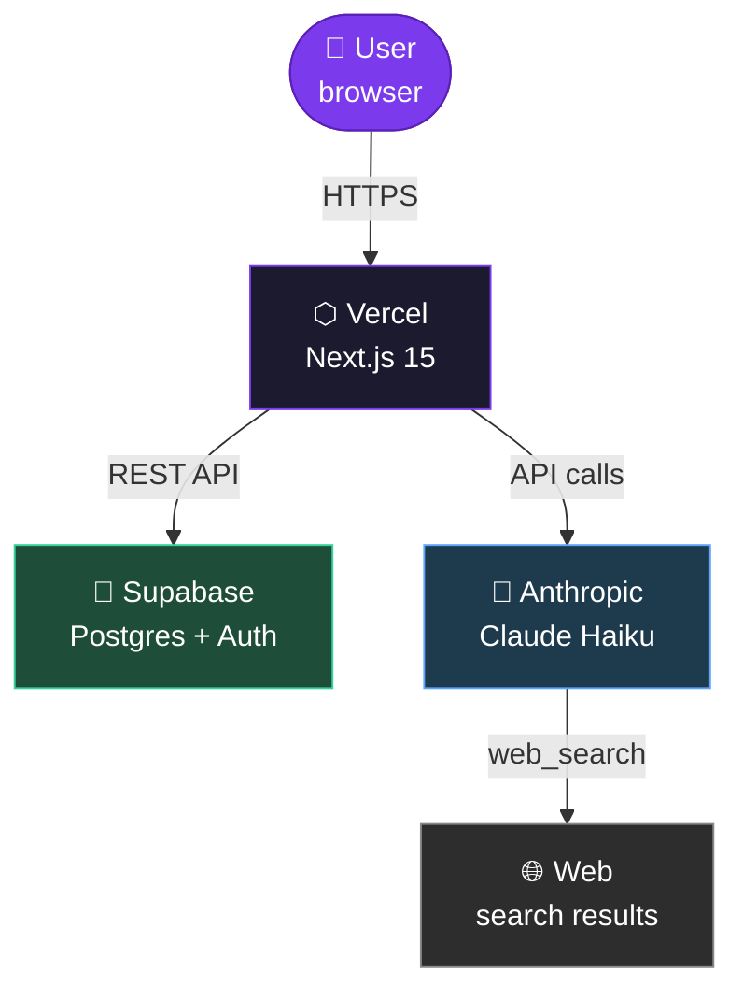

---

## Clean Architecture layers

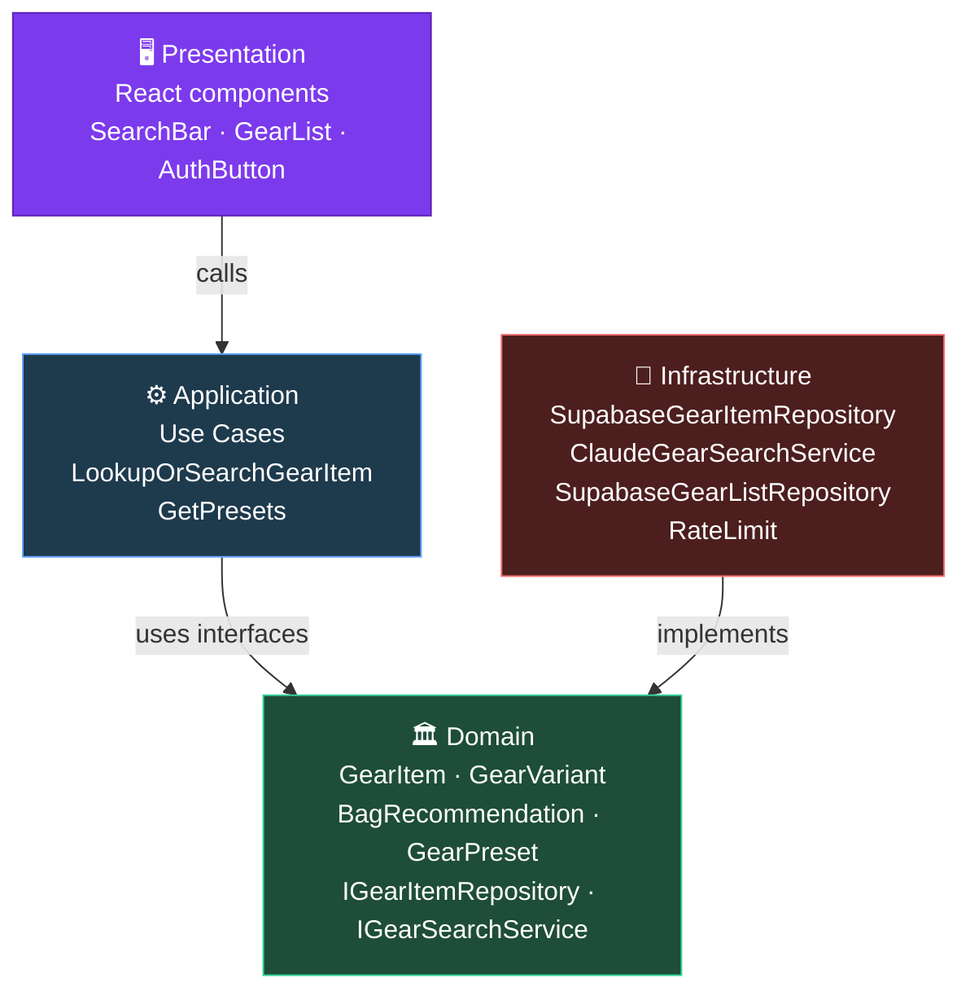

> Стрелки направлены внутрь: Domain не зависит ни от чего. Infrastructure зависит от Domain, но не наоборот.

---

## Folder structure

```
src/
├── domain/
│   └── gear/
│       ├── GearItem.ts           ← aggregate root
│       ├── GearVariant.ts        ← value object
│       ├── GearCategory.ts       ← enum
│       ├── GearCategoryIcon.ts   ← emoji map
│       ├── GearPreset.ts         ← preset type
│       ├── BagRecommendation.ts  ← pure function
│       ├── IGearItemRepository.ts
│       ├── IGearSearchService.ts
│       └── __tests__/
│   └── list/
│       └── GearListItem.ts
│
├── application/
│   └── gear/
│       ├── LookupOrSearchGearItemUseCase.ts
│       └── GetPresetsUseCase.ts
│
├── infrastructure/
│   ├── supabase/
│   │   ├── client.ts                    ← browser client
│   │   ├── server.ts                    ← SSR client (cookies)
│   │   ├── anonClient.ts                ← plain client (writes)
│   │   ├── SupabaseGearItemRepository.ts
│   │   ├── SupabaseGearListRepository.ts
│   │   ├── schema.sql
│   │   └── seed.sql
│   ├── ai/
│   │   └── ClaudeGearSearchService.ts
│   └── security/
│       └── rateLimit.ts
│
├── presentation/
│   └── components/
│       ├── GearCalculator.tsx    ← root component
│       ├── SearchBar.tsx
│       ├── GearList.tsx
│       ├── PresetPanel.tsx
│       ├── BagRecommendationPanel.tsx
│       ├── AuthButton.tsx
│       ├── LanguageSwitcher.tsx
│       ├── Toast.tsx
│       ├── CookieBanner.tsx
│       └── LegalLayout.tsx
│
├── app/                          ← Next.js App Router
│   ├── layout.tsx                ← passthrough root layout
│   ├── [locale]/
│   │   ├── layout.tsx            ← html/body, providers, SEO
│   │   ├── page.tsx              ← reads Supabase user → GearCalculator
│   │   ├── auth/callback/
│   │   ├── privacy/
│   │   ├── terms/
│   │   └── impressum/
│   └── api/
│       ├── lookup/route.ts       ← GET (search) + POST (save)
│       ├── lists/route.ts        ← GET/POST/DELETE
│       ├── auth/route.ts         ← POST (magic link)
│       └── presets/route.ts
│
└── i18n/
    ├── routing.ts
    ├── request.ts
    └── messages/
        ├── en.json
        ├── de.json
        └── ru.json
```

---

## Gear search flow

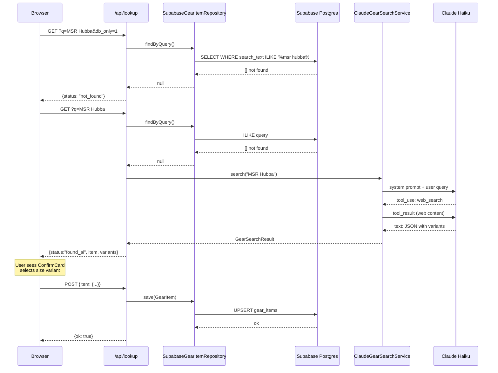

---

## Auth flow

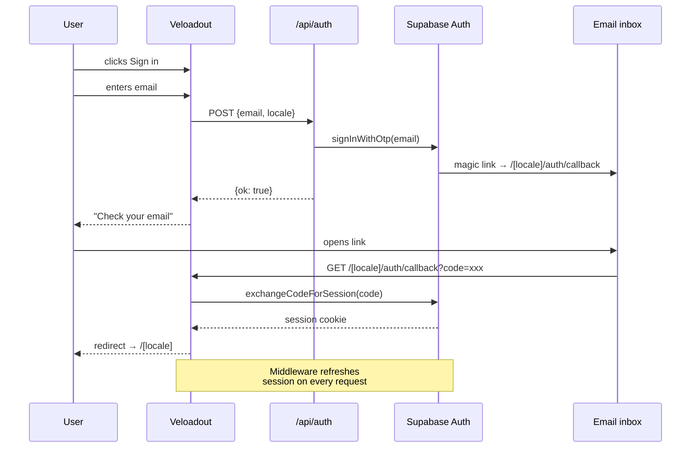

---

## Data model

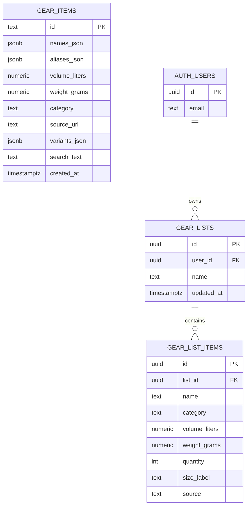

---

## Supabase RLS policies

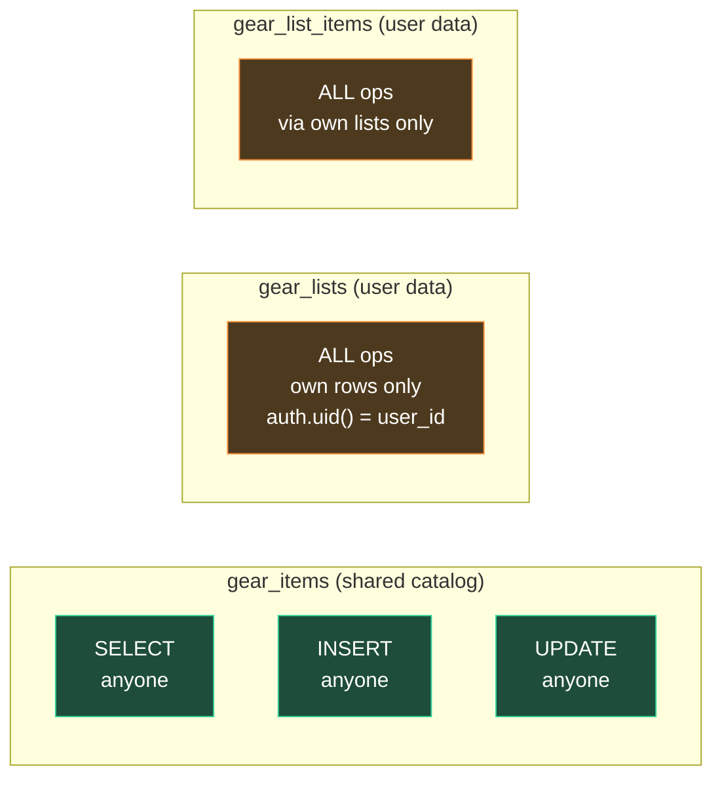

---

## Supabase client usage

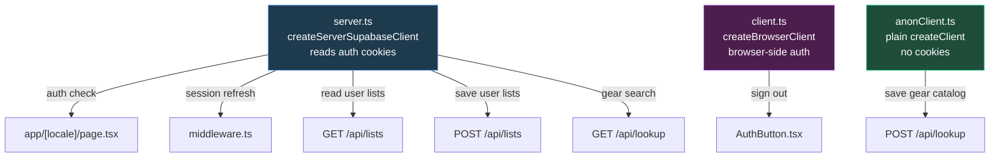

> `anonClient` используется специально для записи в `gear_items` —<br>cookie-based клиент падал с `TypeError: fetch failed` при upsert на сервере.

---

## API routes

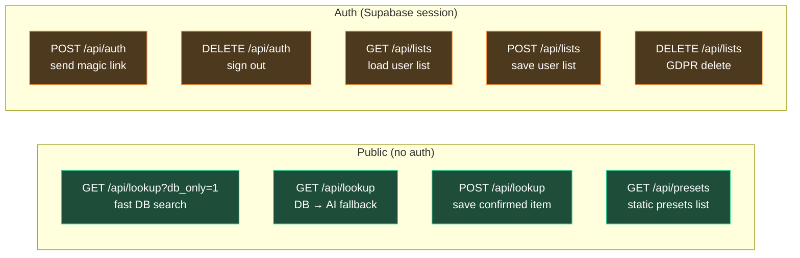

---

## Rate limiting

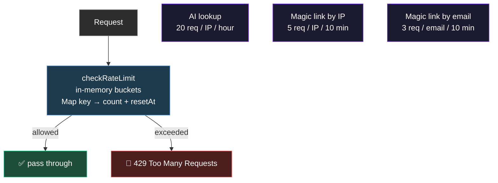

---

## i18n routing

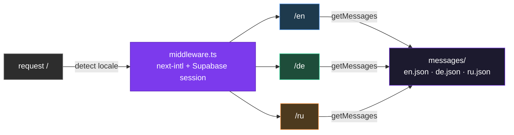

---

## Frontend component tree

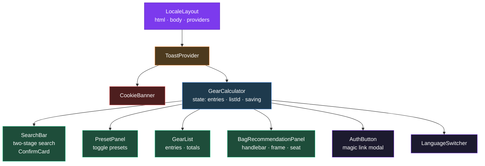

---

## Auto-save flow

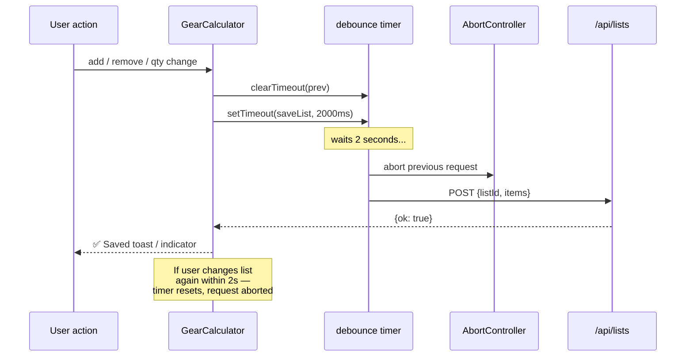

---

## Search index strategy

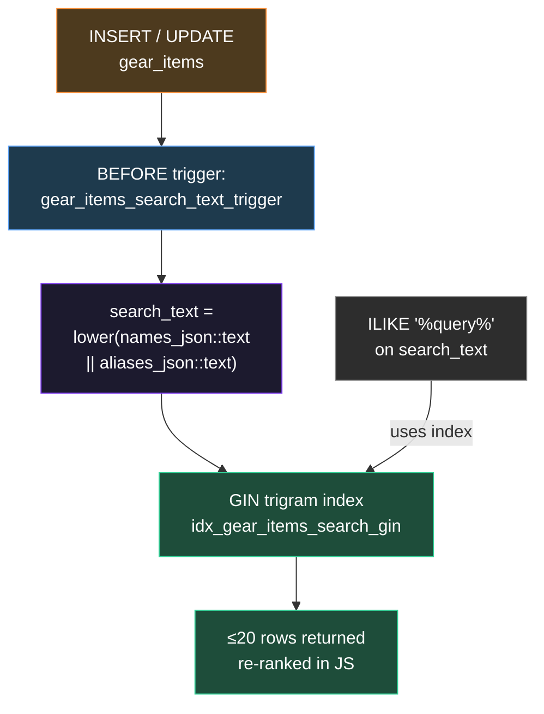

---

## Deployment topology

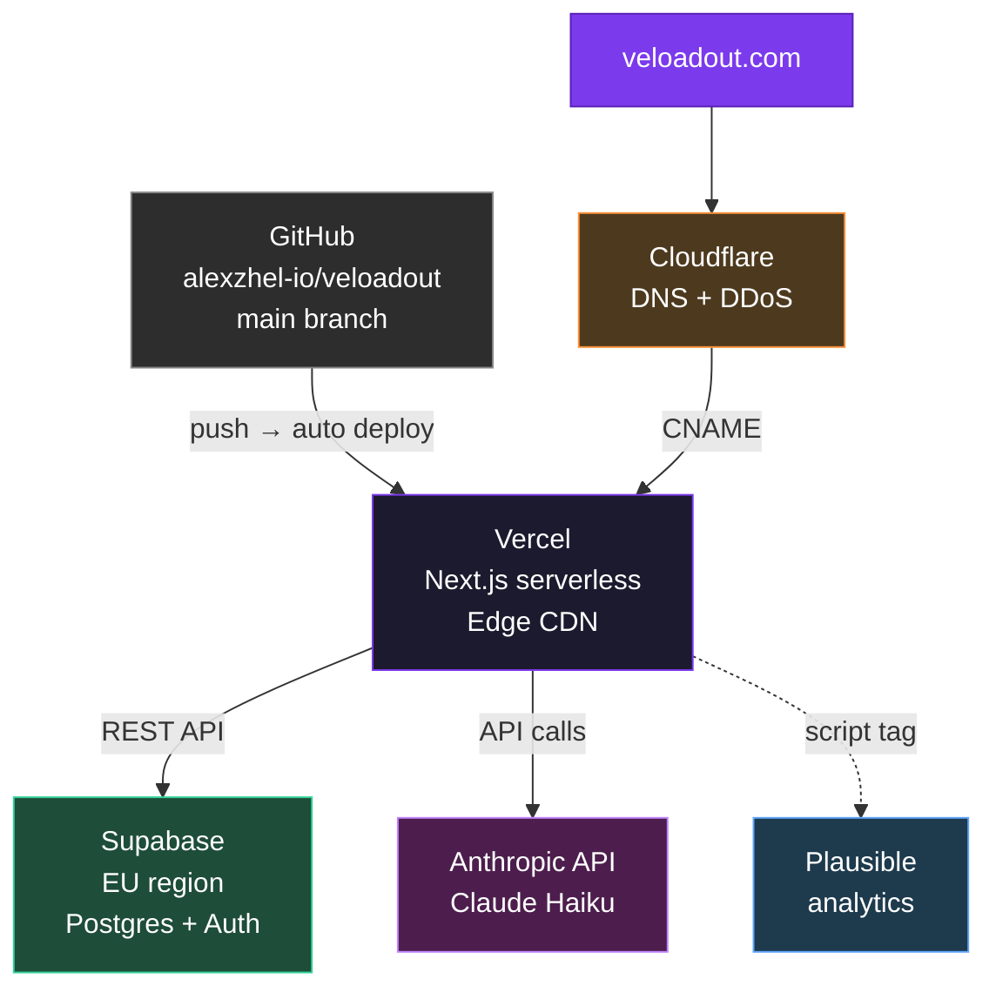
