# Veloadout — Architecture

---

## System context

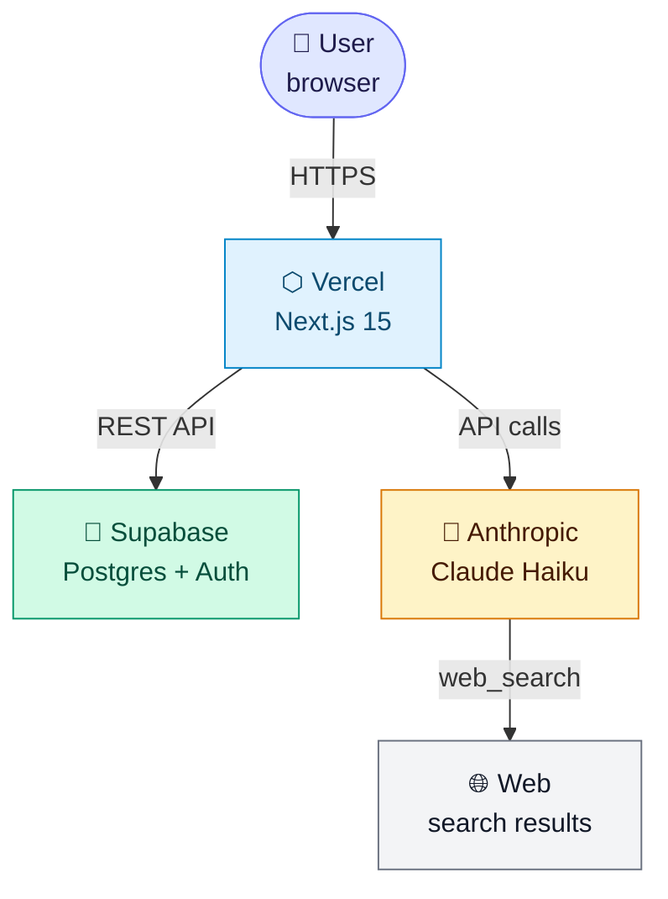

---

## Clean Architecture layers

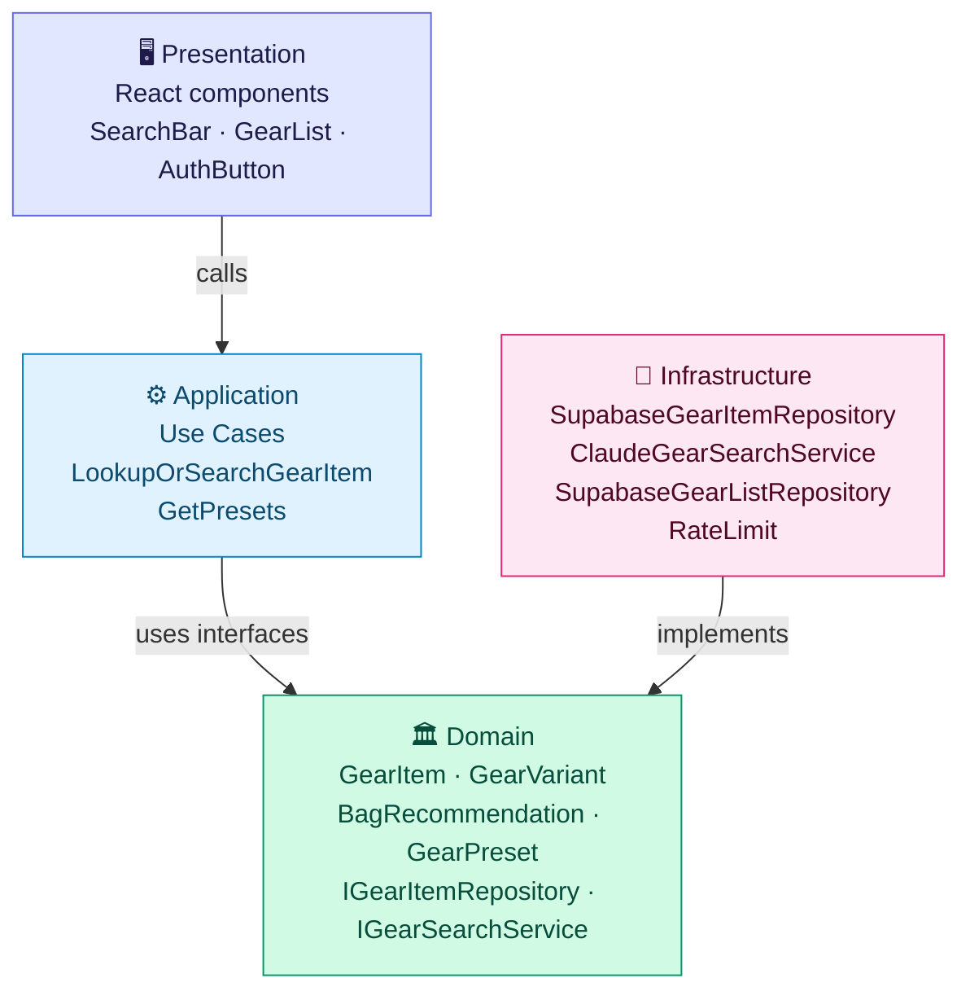

> Arrows point inward: Domain depends on nothing. Infrastructure depends on Domain, never the other way around.

---

## Folder structure

```
src/
├── domain/
│   └── gear/
│       ├── GearItem.ts           ← aggregate root
│       ├── GearVariant.ts        ← value object
│       ├── GearCategory.ts       ← enum
│       ├── GearCategoryIcon.ts   ← emoji map
│       ├── GearPreset.ts         ← preset type
│       ├── BagRecommendation.ts  ← pure function
│       ├── IGearItemRepository.ts
│       ├── IGearSearchService.ts
│       └── __tests__/
│   └── list/
│       └── GearListItem.ts
│
├── application/
│   └── gear/
│       ├── LookupOrSearchGearItemUseCase.ts
│       └── GetPresetsUseCase.ts
│
├── infrastructure/
│   ├── supabase/
│   │   ├── client.ts                    ← browser client
│   │   ├── server.ts                    ← SSR client (cookies)
│   │   ├── SupabaseGearItemRepository.ts
│   │   ├── SupabaseGearListRepository.ts
│   │   ├── schema.sql
│   │   └── seed.sql
│   ├── ai/
│   │   └── ClaudeGearSearchService.ts
│   └── security/
│       └── rateLimit.ts
│
├── presentation/
│   └── components/
│       ├── GearCalculator.tsx    ← root component
│       ├── SearchBar.tsx
│       ├── GearList.tsx
│       ├── PresetPanel.tsx
│       ├── BagRecommendationPanel.tsx
│       ├── AuthButton.tsx
│       ├── LanguageSwitcher.tsx
│       ├── Toast.tsx
│       ├── CookieBanner.tsx
│       └── LegalLayout.tsx
│
├── app/                          ← Next.js App Router
│   ├── layout.tsx                ← passthrough root layout
│   ├── [locale]/
│   │   ├── layout.tsx            ← html/body, providers, SEO
│   │   ├── page.tsx              ← reads Supabase user → GearCalculator
│   │   ├── auth/callback/
│   │   ├── privacy/
│   │   ├── terms/
│   │   └── impressum/
│   └── api/
│       ├── lookup/route.ts       ← GET (search) + POST (save)
│       ├── lists/route.ts        ← GET/POST/DELETE
│       ├── auth/route.ts         ← POST (magic link)
│       └── presets/route.ts
│
└── i18n/
    ├── routing.ts
    ├── request.ts
    └── messages/
        ├── en.json
        ├── de.json
        └── ru.json
```

---

## Gear search flow

```mermaid
sequenceDiagram
    participant B as 🌐 Browser
    participant API as ⚡ /api/lookup
    participant Repo as 🗄️ GearItemRepo
    participant DB as 🐘 Supabase DB
    participant AI as 🤖 ClaudeSearch
    participant LLM as ✨ Claude Haiku

    rect rgb(224, 242, 254)
        Note over B,DB: Stage 1 — fast DB lookup
        B->>API: GET ?q=MSR Hubba&db_only=1
        API->>Repo: findByQuery()
        Repo->>DB: SELECT WHERE search_text ILIKE '%msr hubba%'
        DB-->>Repo: [] not found
        Repo-->>API: null
        API-->>B: {status: "not_found"}
    end

    rect rgb(224, 231, 255)
        Note over B,LLM: Stage 2 — AI search
        B->>API: GET ?q=MSR Hubba
        API->>Repo: findByQuery()
        Repo->>DB: ILIKE query
        DB-->>Repo: [] not found
        API->>AI: search("MSR Hubba")
        AI->>LLM: system prompt + user query
        LLM-->>AI: tool_use: web_search
        AI->>LLM: tool_result (web content)
        LLM-->>AI: JSON with variants
        AI-->>API: GearSearchResult
        API-->>B: {status:"found_ai", item, variants}
    end

    rect rgb(254, 243, 199)
        Note over B,LLM: Stage 3 — optional "dig deeper" retry (≤2×)
        Note over B: User clicks button on ConfirmCard
        B->>API: GET ?q=MSR Hubba&depth=2
        Note over API,LLM: Skips DB cache; max_uses=6,<br>max_turns=8, stricter prompt
        API->>AI: search("MSR Hubba", depth=2)
        AI->>LLM: enumerate-all-sizes prompt
        LLM-->>AI: JSON with more variants
        AI-->>API: GearSearchResult
        API-->>B: {status:"found_ai", item, variants}
        Note over B: original id preserved →<br>upsert updates same row
    end

    rect rgb(209, 250, 229)
        Note over B,DB: Stage 4 — user confirms & saves
        B->>API: POST {item: {...}}
        API->>Repo: save(GearItem)
        Repo->>DB: UPSERT gear_items
        DB-->>Repo: ok
        API-->>B: {ok: true}
    end
```

---

## Auth flow

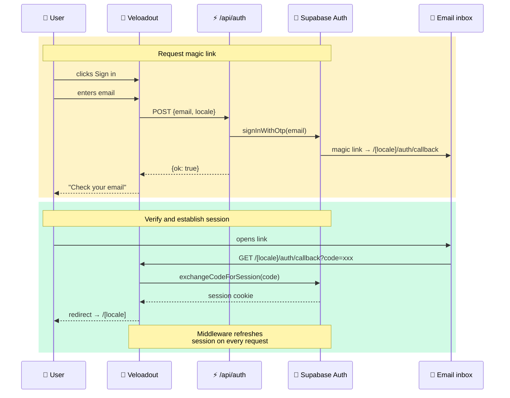

---

## Data model

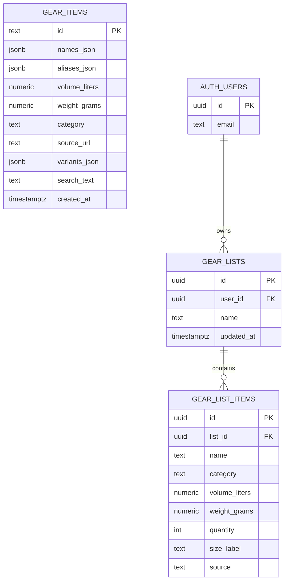

---

## Supabase RLS policies

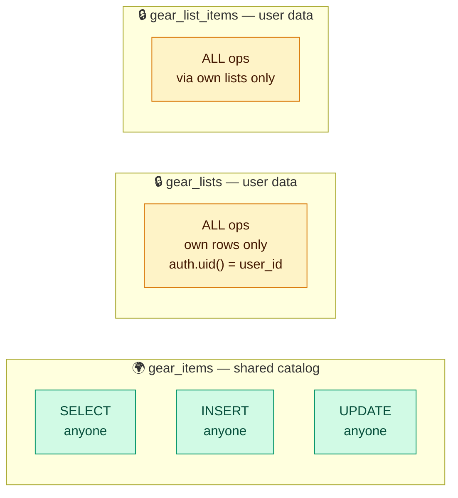

---

## Supabase client usage

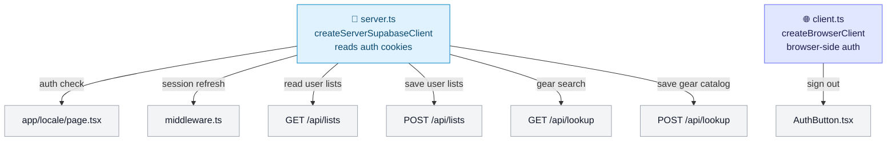

---

## API routes

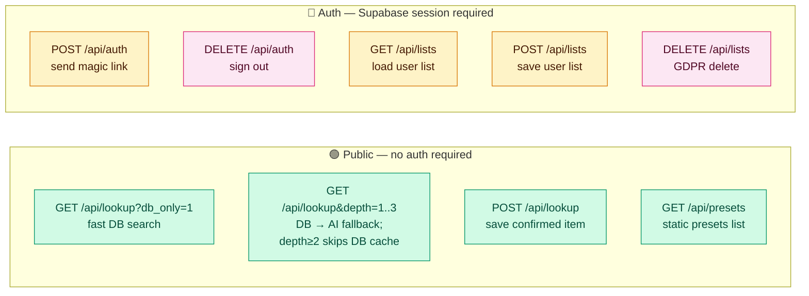

---

## Rate limiting

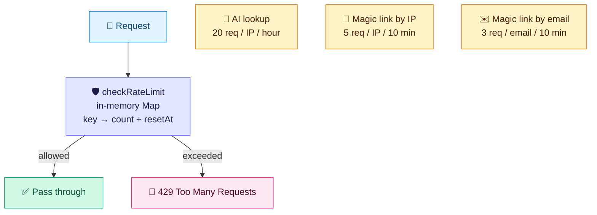

---

## i18n routing

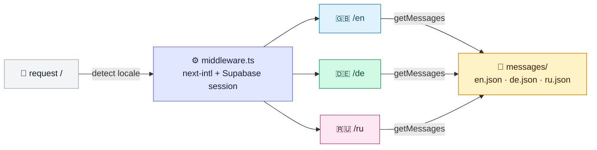

---

## Frontend component tree

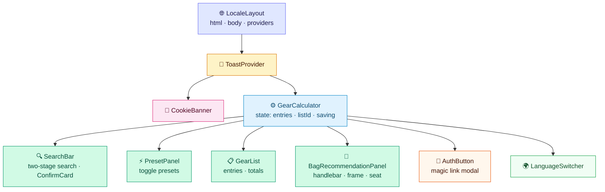

---

## Auto-save flow

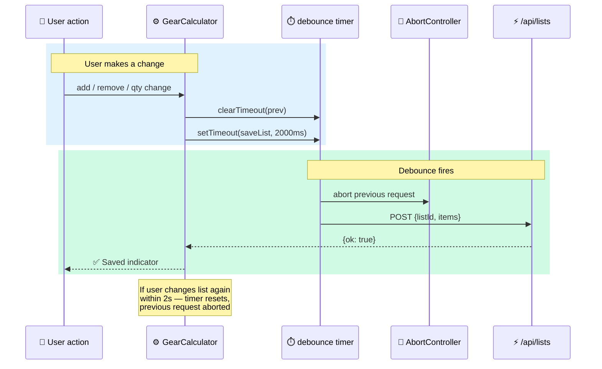

---

## Search index strategy

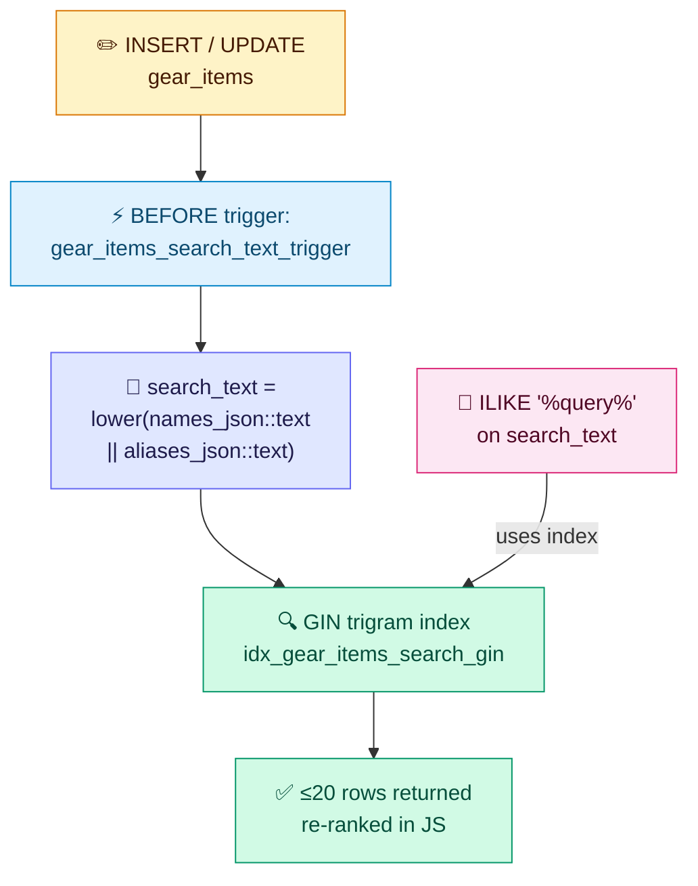

---

## Deployment topology

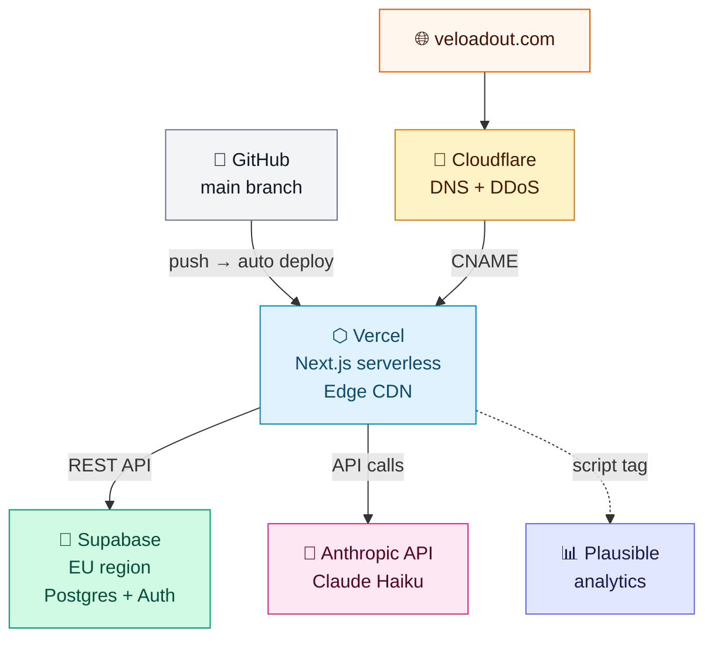
