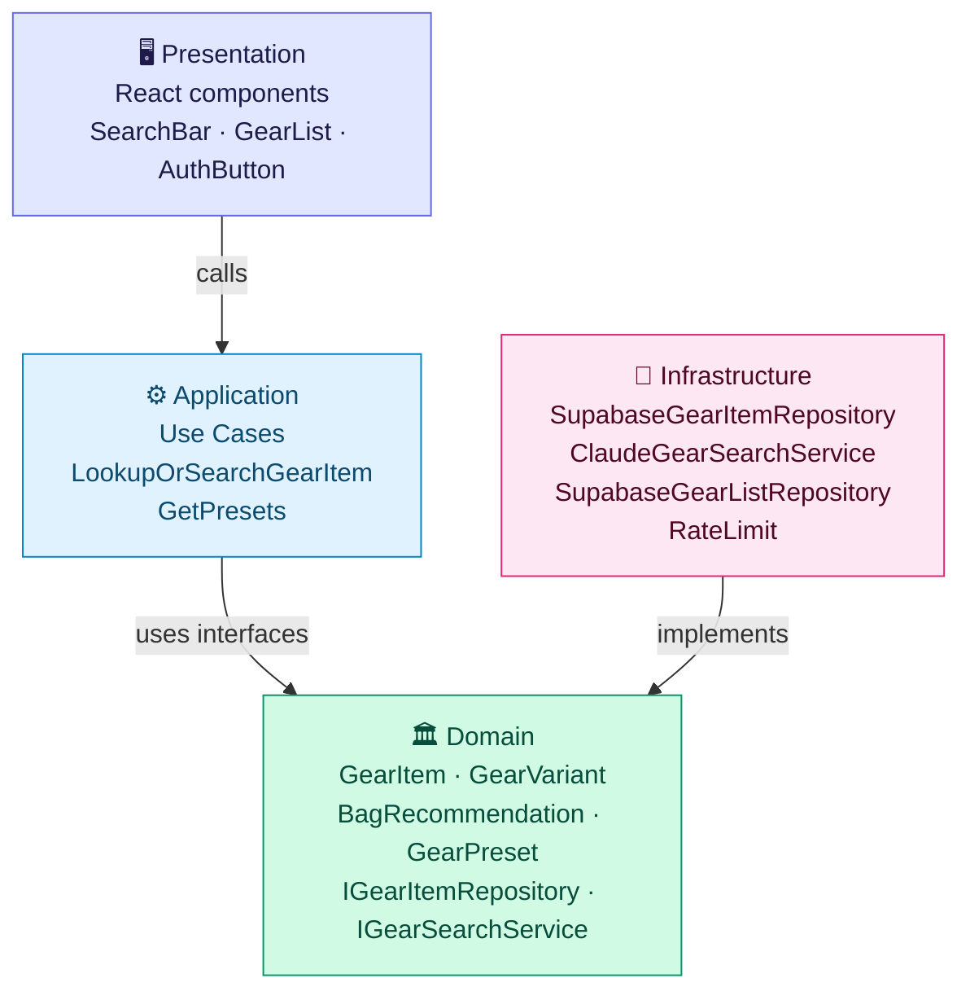
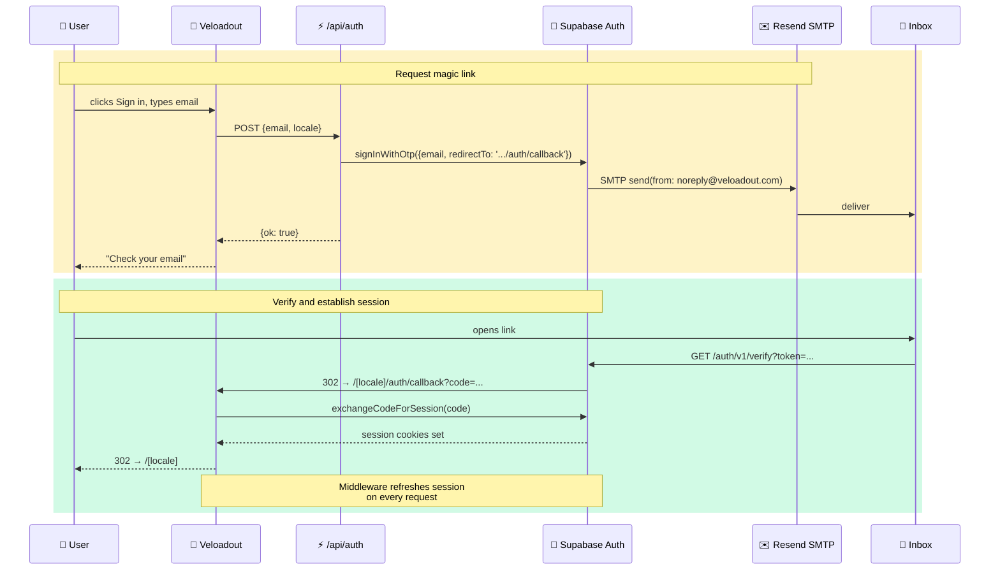
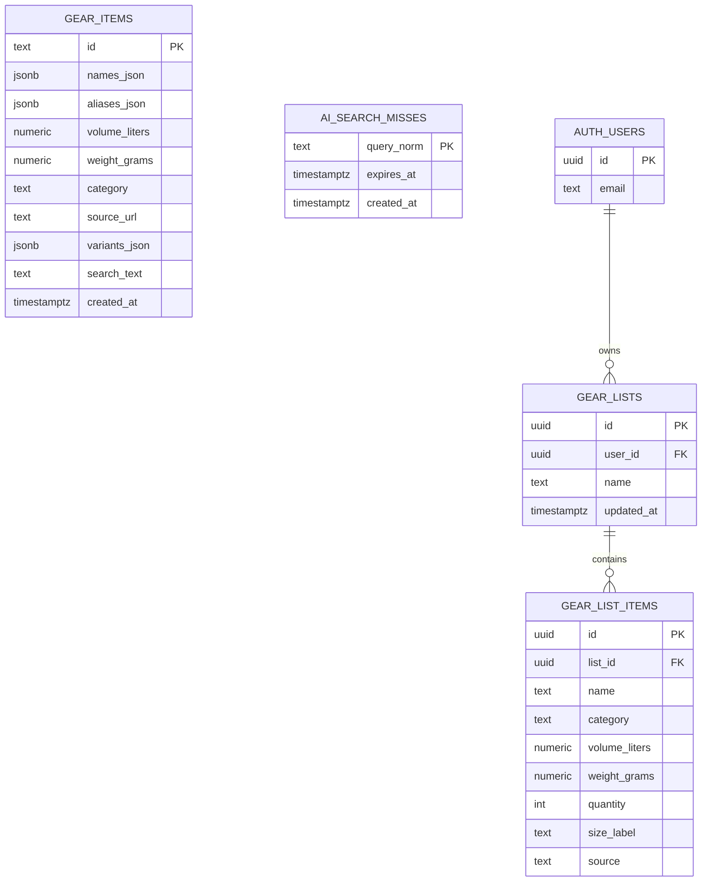
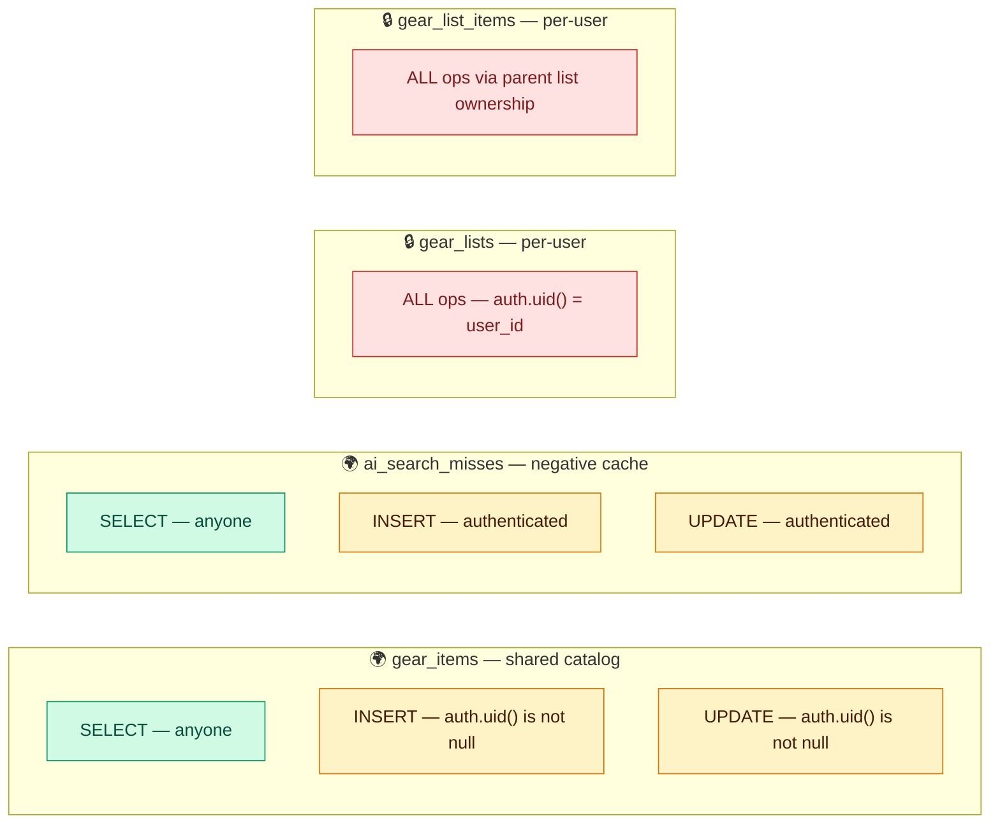
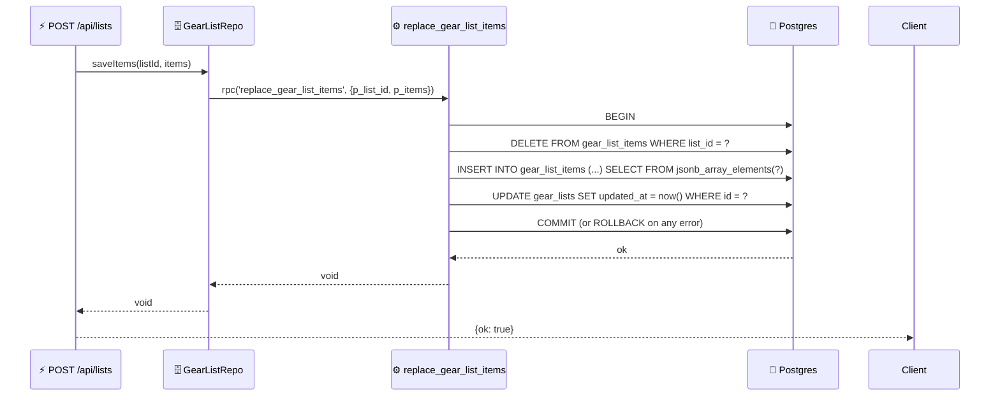
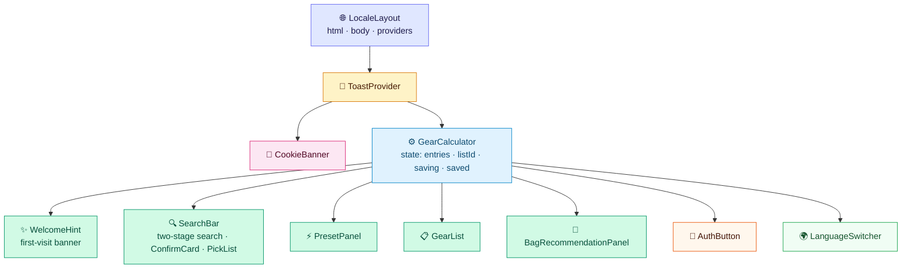
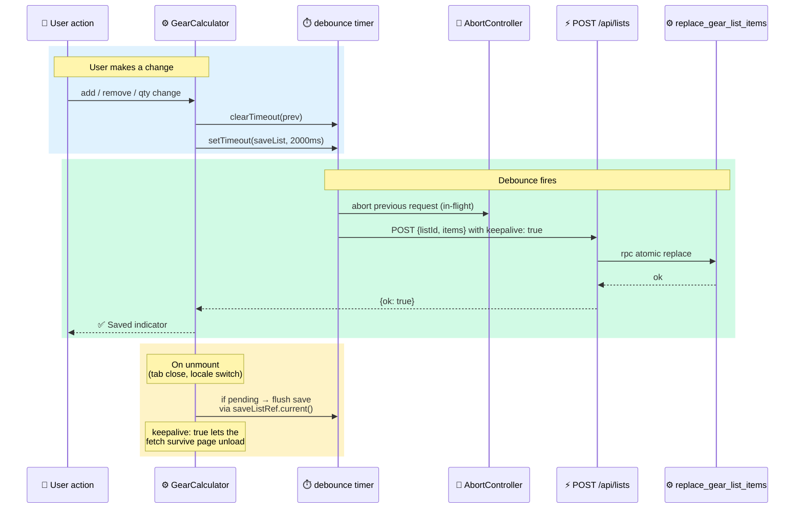
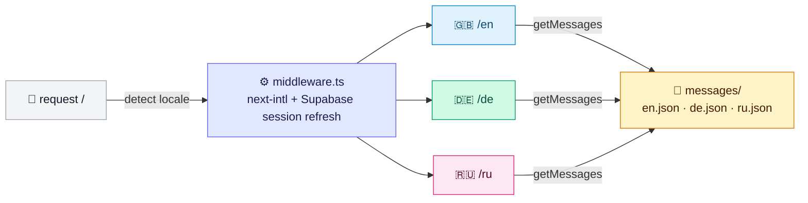
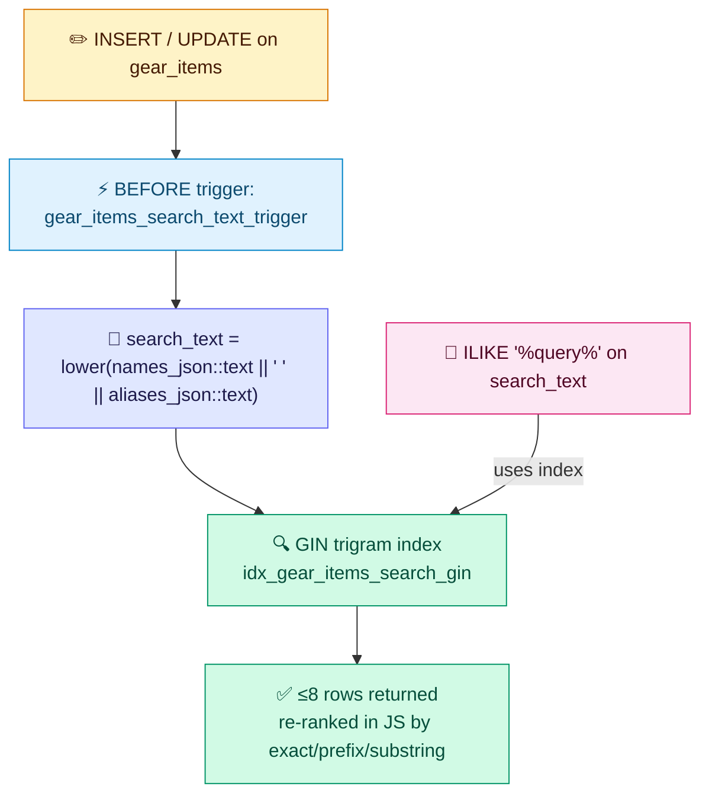
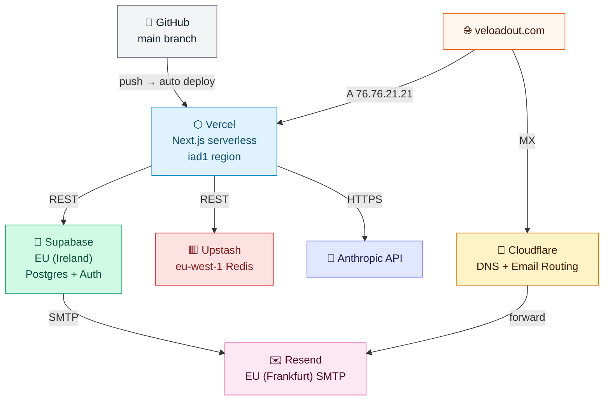

# Veloadout — Architecture

This document explains the **why** behind every major design decision. If
you're new to the project and want to understand how it's wired up — and
why it's wired that way and not some other way — read this top to bottom.

For concrete operational details (DNS records, env vars, recovery
playbooks), see [`operations.md`](./operations.md).

---

## What the app does, in one paragraph

Veloadout is a bikepacking gear volume calculator. The user enters the
products they want to bring on a trip (e.g. "Thermarest NeoAir XLite",
"MSR Hubba Hubba 2P"), the app sums up the packed volume across all
items, and recommends how to distribute that volume between three bike
bags — handlebar, frame, seat. When a product isn't already in the
shared catalog, Claude AI searches the web for the manufacturer's spec
sheet, extracts the packed volume and size variants, and offers the
result to the user for confirmation. Confirmed items are written back to
the catalog so the next person who searches for the same product gets
an instant DB hit.

The non-obvious part: the catalog is a **shared, community-edited
resource** rather than a private per-user inventory. That choice
cascades into a lot of the security architecture below.

---

## System context — who talks to whom

```mermaid
graph TD
    User(["👤 User<br>browser"])
    Vercel["⬡ Vercel<br>Next.js 15"]
    Supabase["🐘 Supabase<br>Postgres + Auth"]
    Anthropic["🤖 Anthropic<br>Claude Haiku"]
    Web["🌐 Web<br>search results"]
    Upstash["🟥 Upstash<br>Redis"]
    Resend["✉️ Resend<br>SMTP"]
    Cloudflare["🔶 Cloudflare<br>DNS + Email"]

    User -->|HTTPS| Cloudflare
    Cloudflare -->|A/CNAME| Vercel
    Vercel -->|REST| Supabase
    Vercel -->|REST| Upstash
    Vercel -->|REST| Anthropic
    Anthropic -->|web_search tool| Web
    Supabase -->|SMTP| Resend
    Resend -->|email| User
    User -->|support@| Cloudflare

    style User fill:#e0e7ff,stroke:#6366f1,color:#1e1b4b
    style Vercel fill:#e0f2fe,stroke:#0284c7,color:#0c4a6e
    style Supabase fill:#d1fae5,stroke:#059669,color:#064e3b
    style Anthropic fill:#fef3c7,stroke:#d97706,color:#451a03
    style Web fill:#f3f4f6,stroke:#6b7280,color:#111827
    style Upstash fill:#fee2e2,stroke:#dc2626,color:#7f1d1d
    style Resend fill:#fce7f3,stroke:#db2777,color:#500724
    style Cloudflare fill:#fed7aa,stroke:#ea580c,color:#7c2d12
```

Seven external dependencies sounds like a lot for a small app, but each
one earns its place:

- **Vercel** is the host. Next.js works best there, and the
  serverless model means zero ops for low-traffic apps.
- **Supabase** is the persistence + identity layer. Postgres + Auth +
  RLS lets us skip writing a backend.
- **Anthropic** powers the AI catalog lookup. We picked Claude over
  GPT primarily because of the `web_search` tool — built-in retrieval
  without us hosting our own scraper.
- **Cloudflare** is DNS (apex + www) plus free Email Routing for
  `support@veloadout.com`. We don't use their proxy / CDN because it
  fights with Vercel's TLS.
- **Resend** sends magic-link emails. Without a custom SMTP,
  Supabase's built-in mailer caps the whole project at ~2 emails/hour
  — useless for anything real.
- **Upstash** is Redis for rate limiting and the daily AI budget
  counter. We need shared state across serverless instances; the
  in-memory `Map` we started with resets on every cold start.
- The **Web** isn't ours, but it's a real dependency: when Claude
  searches the web for a product spec, the freshness and accuracy of
  the answer depends on the manufacturer's site being up and
  reasonably crawlable.

---

## Clean Architecture & DDD — why the codebase is shaped this way

The codebase is organised in four concentric layers:



**Why bother with Clean Architecture for a small app?** Two reasons,
both pragmatic, not ideological:

1. **The infrastructure layer changes faster than the domain.** We've
   already swapped: SQLite → Supabase, browser-side saves → server-side
   saves, in-memory rate limit → Upstash, Supabase built-in SMTP →
   Resend. Each swap was a single-file change in `infrastructure/`
   because the rest of the code talks to interfaces, not concrete
   clients. If everything were a giant `route.ts` calling Supabase
   directly, those migrations would have been multi-day refactors.

2. **The domain logic is testable in isolation.** `BagRecommendation`
   and `GearVariant` matching live in `domain/` as pure functions. The
   Vitest suite hits them directly without spinning up Postgres or
   mocking fetch. Total runtime: ~3 ms for 11 tests.

The rule is one sentence: **the domain layer imports nothing from the
outside world.** It doesn't know about Postgres, React, or Anthropic.
The application layer (use cases) orchestrates domain objects. The
infrastructure layer implements the domain interfaces. The presentation
layer reaches into use cases via API routes.

Concretely:

- `IGearItemRepository` is declared in `domain/gear/`. It has methods
  like `findByQuery`, `findManyByQuery`, `save`.
- `SupabaseGearItemRepository` lives in `infrastructure/supabase/`
  and implements that interface.
- The use case (`LookupOrSearchGearItemUseCase`) accepts the interface
  in its constructor. It never knows it's talking to Supabase.

If we ever leave Supabase, we write a new repository class and that's
it.

---

## Folder structure

```
src/
├── domain/
│   └── gear/
│       ├── GearItem.ts           ← aggregate root with invariants
│       ├── GearVariant.ts        ← value object + matcher
│       ├── GearCategory.ts       ← enum + i18n labels
│       ├── GearCategoryIcon.ts   ← emoji map
│       ├── GearPreset.ts         ← preset type
│       ├── BagRecommendation.ts  ← pure recommendation algorithm
│       ├── IGearItemRepository.ts
│       ├── IGearSearchService.ts
│       └── __tests__/            ← Vitest suite
│   └── list/
│       └── GearListItem.ts
│
├── application/
│   └── gear/
│       ├── LookupOrSearchGearItemUseCase.ts   ← DB-first, AI-fallback orchestration
│       └── GetPresetsUseCase.ts
│
├── infrastructure/
│   ├── supabase/
│   │   ├── client.ts                    ← browser client
│   │   ├── server.ts                    ← SSR client (cookies)
│   │   ├── SupabaseGearItemRepository.ts
│   │   ├── SupabaseGearListRepository.ts
│   │   ├── aiSearchMissCache.ts         ← negative cache for AI
│   │   ├── schema.sql                   ← canonical source of DB schema
│   │   └── seed.sql                     ← preset/category seed data
│   ├── ai/
│   │   └── ClaudeGearSearchService.ts   ← Anthropic + web_search + Zod
│   └── security/
│       ├── rateLimit.ts                 ← Upstash with in-memory fallback
│       └── queryHeuristics.ts           ← cheap garbage filter
│
├── presentation/
│   ├── components/                      ← React components
│   │   ├── GearCalculator.tsx           ← root, owns list state
│   │   ├── SearchBar.tsx                ← search + AI flow + ConfirmCard
│   │   ├── GearList.tsx                 ← list rendering + totals
│   │   ├── PresetPanel.tsx
│   │   ├── BagRecommendationPanel.tsx
│   │   ├── AuthButton.tsx
│   │   ├── WelcomeHint.tsx              ← dismissible first-visit banner
│   │   ├── LanguageSwitcher.tsx
│   │   ├── Toast.tsx
│   │   ├── CookieBanner.tsx
│   │   └── LegalLayout.tsx
│   └── utils/
│       └── safeUrl.ts                   ← XSS defence on rendered URLs
│
├── app/                                 ← Next.js App Router
│   ├── layout.tsx                       ← passthrough root layout
│   ├── [locale]/                        ← /en, /de, /ru
│   │   ├── layout.tsx                   ← html/body, providers, SEO metadata
│   │   ├── page.tsx                     ← reads Supabase user → renders GearCalculator
│   │   ├── help/                        ← user-facing quick-start guide
│   │   ├── auth/callback/               ← magic-link exchange
│   │   ├── privacy/, terms/, impressum/
│   └── api/
│       ├── lookup/route.ts              ← GET (search) + POST (save) with 5-layer AI guard
│       ├── lists/route.ts               ← GET/POST/DELETE user list
│       ├── auth/route.ts                ← POST (magic link)
│       └── presets/route.ts
│
└── i18n/
    ├── routing.ts                       ← locales: ['en', 'de', 'ru']
    ├── request.ts                       ← locale resolution per request
    └── messages/{en,de,ru}.json         ← string tables
```

---

## The gear search flow — the most-traffic-affecting path

This is the single most important request path in the app, so it gets
the most words.

```mermaid
sequenceDiagram
    participant B as 🌐 Browser
    participant API as ⚡ /api/lookup
    participant Repo as 🗄️ GearItemRepo
    participant DB as 🐘 Supabase DB
    participant Cache as 💭 ai_search_misses
    participant Auth as 🔐 Supabase Auth
    participant RL as 🟥 Upstash
    participant AI as 🤖 ClaudeSearch
    participant LLM as ✨ Claude Haiku

    rect rgb(224, 242, 254)
        Note over B,DB: Stage 1 — fast DB lookup (anonymous OK)
        B->>API: GET ?q=MSR Hubba&db_only=1
        API->>Repo: findManyByQuery()
        Repo->>DB: SELECT WHERE search_text ILIKE '%msr hubba%' LIMIT 8
        DB-->>Repo: [] not found
        Repo-->>API: []
        API-->>B: {status: "not_found"}
    end

    rect rgb(224, 231, 255)
        Note over B,LLM: Stage 2 — AI search (auth + 5 guards)
        B->>API: GET ?q=MSR Hubba&depth=1
        API->>Auth: getUser()
        Auth-->>API: user (else 401)
        Note over API: heuristic filter — looksLikeGarbage?
        API->>RL: INCR rl:lookup:user:<uuid>
        RL-->>API: count ≤ 20 ✓
        API->>Cache: SELECT FROM ai_search_misses WHERE query_norm = ?
        Cache-->>API: no row (cache miss)
        API->>RL: INCR budget:ai_lookup:<today>
        RL-->>API: count ≤ 500 ✓
        API->>AI: search("MSR Hubba", depth=1)
        AI->>LLM: system prompt + user query + web_search tool
        LLM-->>AI: tool_use: web_search(query)
        AI->>LLM: tool_result (server-fetched web content)
        LLM-->>AI: JSON with variants
        Note over AI: Zod-validate response;<br>coerce category to 'other' if unknown
        AI-->>API: GearSearchResult
        API-->>B: {status:"found_ai", item, variants, confidence}
    end

    rect rgb(254, 243, 199)
        Note over B,LLM: Stage 3 — optional "dig deeper" retry (depth 2 or 3)
        Note over B: User clicks button on ConfirmCard
        B->>API: GET ?q=MSR Hubba&depth=2
        Note over API,LLM: Skips DB cache; max_uses=6,<br>max_turns=8, stricter prompt
        API->>AI: search("MSR Hubba", depth=2)
        AI->>LLM: enumerate-all-sizes prompt
        LLM-->>AI: JSON with more variants
        AI-->>API: GearSearchResult
        API-->>B: {status:"found_ai", item, variants}
        Note over B: original id preserved →<br>upsert updates same row
    end

    rect rgb(209, 250, 229)
        Note over B,DB: Stage 4 — user confirms & saves (auth required)
        B->>API: POST {item: {...}}
        API->>Auth: getUser()
        Auth-->>API: user (else 401)
        Note over API: derive id = slug(item.names.en)
        API->>Repo: save(GearItem)
        Repo->>DB: UPSERT gear_items (id PK)
        DB-->>Repo: ok
        API-->>B: {ok: true, id}
    end
```

**Why DB-first, AI-fallback?** Anthropic costs money and is slow
(2–20 s for a web-search loop). Postgres with a GIN trigram index
returns in <50 ms even with thousands of rows. Most repeat searches hit
the DB, so most requests cost nothing and are instant.

**Why a separate `db_only=1` query before the AI path?** Because the
two have different security requirements. DB search is anonymous —
showing volumes to a casual visitor is the entry point of the app.
AI search requires auth (see the abuse defence section below). If we
combined them into one endpoint, we'd either have to require auth for
DB lookups (breaks the UX for anonymous users) or open AI to everyone
(bankruptcy via runaway calls).

**Why "dig deeper" with multiple depths?** Initial AI calls are cheap
but sometimes incomplete — Claude might return one variant of a tent
when the product line has six sizes. The user gets a "Search the web
more thoroughly" button on the ConfirmCard; it bumps the depth, which
in turn increases `max_uses` for the `web_search` tool, lets the model
take more turns, and switches to a stricter system prompt that
explicitly nudges enumeration. Depth caps at 3 because by then it's
clear the model isn't going to find more.

**Why server-derived id from the English name slug?** When the user
confirms an AI result, we need to write a row to `gear_items`. If the
client controlled the id, a malicious user could pass an existing
catalog row's id and overwrite legitimate data (e.g., wipe out the
Thermarest entry by submitting `{id: "thermarest-neoair-xlite-nxt",
names: {en: "Pwned"}, ...}`). Deriving the id server-side from
`slugify(names.en)` means a vandal can only overwrite a row whose
English name they already know — and they have to use that exact name.
This also gives us a nice property: "dig deeper" on a known product
naturally updates that product's row in place, because the slug is
stable.

---

## Why the shared catalog is risky, and how we defend it

The catalog is **shared globally**. Anyone signed in can write to it.
This is intentional: it means the database gets richer every time a
real user confirms an AI result. But it also means abuse vectors:

- **Vandalism** — overwrite real data with garbage.
- **AI quota burning** — feed nonsense queries to chew through
  Anthropic credits.
- **Email-bombing via magic links** — sign up burst on someone else's
  email.

The defence layers, top down:

1. **Auth required for AI search.** No anonymous AI calls. This
   removes the easiest abuse path: scripted requests from a single IP
   are limited to DB lookups (cheap, fast, deterministic).
2. **Heuristic pre-filter** (`looksLikeGarbage`). Before the AI call,
   we reject queries that fail simple checks: <3 or >80 chars, no
   letters, only 1–2 unique chars, runs of one repeated character (5+),
   mostly non-alphanumeric, long tokens with no vowels (random
   keymashing). Conservative — false negatives are cheap (one wasted AI
   call), false positives block legitimate searches.
3. **Per-user rate limit** via Upstash. 20 AI calls / user / hour. The
   key includes the Supabase user ID, not the IP — auth makes this
   stable across browser/network changes.
4. **Negative cache** in Postgres. If a query returned `not_found`,
   we write its normalised form to `ai_search_misses` with a 24h TTL.
   Repeat queries skip AI entirely. The miss cache is read-public,
   write-authenticated, with RLS — same model as `gear_items`.
5. **Global daily budget** via Upstash. The key is
   `budget:ai_lookup:<UTC-date>`. The first call of the day creates
   the key and sets a 24h+1h TTL. We allow up to 500 incrementations
   per day project-wide; the 501st call gets a 503 with a translated
   "service temporarily unavailable, try tomorrow" message. This is
   the cost ceiling.

If Upstash itself is unreachable, layers 3 and 5 degrade differently:
layer 3 falls back to per-instance in-memory counters (weaker but not
worse than nothing), layer 5 fails open (allows the call). We chose
fail-open for layer 5 because false-positive 503s during a Redis
outage would block all real users; the bigger risk (runaway cost) is
something we can catch out-of-band via the Anthropic dashboard.

---

## Auth flow — why magic-link only



**Why magic link, not passwords?** Three reasons:

1. **No password storage liability.** Even with bcrypt and best
   practices, password storage means breach-response obligations under
   GDPR Art. 33 (72-hour notification window). Magic-link tokens are
   one-shot and expire — there's no high-value blob to leak.
2. **No "forgot password" flow.** That flow also depends on email, so
   we'd be solving the same SMTP problem twice with extra UI.
3. **Lower friction for first-time users.** No account creation step
   — first magic link is both signup and signin.

The trade-off: every session expiry requires another email round-trip.
With Supabase's default refresh-token lifetime of 30 days, this is
~12 round-trips/year for an active user — acceptable.

**Why Resend instead of Supabase's built-in SMTP?** Supabase's built-in
mailer is rate-limited to ~2 emails/hour project-wide on the free
plan. That caps **all sign-ups + sign-ins for the whole app at 48/day**
— useless. Resend's free tier gives us 100/day and 3000/month from
`noreply@veloadout.com`, with proper SPF/DKIM/DMARC for deliverability.

**Why is the locale baked into the redirect URL?** Supabase's
"Redirect URLs" allowlist accepts wildcards, but only at the end. So
we explicitly whitelist `https://veloadout.com/{en,de,ru}/auth/callback`
and pass the active locale via `emailRedirectTo`. The callback handler
validates the locale against `routing.locales` before redirecting —
otherwise an attacker could craft a malicious locale to redirect users
to a broken page.

**What about PKCE failures?** Magic links use PKCE, which stores a
`code_verifier` cookie when the user requests the link. If the user
clicks the link in a different browser (or after clearing cookies),
verification fails. We now surface this via `?auth_error=...` query
param so the home page can show a useful message instead of silently
landing the user in a logged-out state.

---

## Data model & why each table looks the way it does



**`gear_items.id` is `text`, not `uuid`.** Because the id is a
slugified English name, it's both human-readable in URLs/logs and
acts as a deduplication key. Same product name → same id → upsert
updates in place.

**`names_json` is `jsonb` with three language keys.** We could have
normalised this into a `gear_item_names(item_id, locale, name)` table,
but every lookup needs all three names for the i18n UI. Storing as
jsonb keeps reads single-row and the GIN trigram index can index the
serialised form directly.

**`search_text` is a denormalised string maintained by a trigger.**
We can't put a GIN trigram index directly on `jsonb` columns, so we
compute `lower(names_json::text || ' ' || aliases_json::text)` on
every write via a `BEFORE INSERT OR UPDATE` trigger. The `pg_trgm`
extension's GIN index on this text column makes `ILIKE '%query%'`
fast even at tens of thousands of rows.

**`variants_json` is a `jsonb` array.** Always non-empty (Zod
enforces). A product with only one size still has a `[{sizeLabel:
"Standard", ...}]` row, which keeps the UI rendering simple — no null
checks for "variants vs no variants".

**`ai_search_misses` is a negative cache.** Without it, every
"asdfasdf" or "what's a phone" query would burn a fresh AI call. With
it, only the first one does; the rest short-circuit for 24 hours. The
TTL is implemented at the query level (`gt('expires_at', now)`), not
via Postgres TTL — Postgres doesn't have row-level TTL natively. Stale
rows accumulate; we have a manual cleanup query in `operations.md`.

**`gear_lists` + `gear_list_items` are 1:N per user.** A user can in
principle have multiple lists, but the UI only shows the most recent
one (`get_or_create_list` returns the latest by `updated_at`). Two
tables instead of one `jsonb` items array on `gear_lists` because:
(a) atomic updates are easier with a child table + RPC; (b) future
features like per-item history or sharing benefit from rows-not-blobs.

---

## RLS — the security boundary that actually matters

Supabase RLS is on for every table. The policies are simple and
mirror the data model:



**Why anonymous SELECT on `gear_items`?** The catalog is the product.
Anonymous visitors must be able to search before deciding to sign up.

**Why authenticated-only INSERT/UPDATE on `gear_items`?** Originally
these policies were `with check (true)` (anyone). That was an early
mistake — an unauthenticated visitor could write arbitrary catalog
rows. We tightened it during the security review; now writing requires
a Supabase session, and our `/api/lookup` POST handler also verifies
the session before passing the request to the repository.

**Why isn't there a per-row "created_by" check?** Because the catalog
is shared by design. Anyone can refine any product's data — that's the
crowdsourced nature of it. Audit + revert features (who changed what
and when) are tracked as future work but not implemented today.

**Why are `gear_lists` and `gear_list_items` RLS'd via
`auth.uid() = user_id`?** Each user's list is their own. The
list-items table doesn't have `user_id` directly — it goes through
`list_id IN (SELECT id FROM gear_lists WHERE user_id = auth.uid())`.
This means a single misconfigured CASCADE delete on `gear_lists` will
correctly cascade through to items, and a stolen list_id alone is
useless without a valid session.

---

## Why an atomic RPC for list saves



The original implementation did three independent Supabase calls:
delete all items, insert new items, update timestamp. If the insert
failed for any reason — RLS denial, network blip, validation error —
the user's list was already wiped and they were left with nothing.

Wrapping it in a Postgres function with `security invoker` means:

- The whole thing runs as a single transaction. Failure rolls back.
- `security invoker` respects RLS, so users still can't replace
  someone else's list — even though the function itself has no per-row
  ownership check.
- The client only makes one round-trip to Supabase instead of three,
  which is also faster.

---

## Frontend state model



**Why is all state in `GearCalculator` and not Redux/Zustand?** The
state graph is small — entries, listId, saving flag, saved flag.
Lifting it to a global store would cost more in indirection than it
saves. Children receive entries via props and dispatch via callbacks.
When the state model grows past, say, 6–8 fields shared across more
than 3 component layers, that calculus changes — but we're not there.

**Why does `GearCalculator` own the auto-save logic and not a custom
hook?** Mostly historical — it would refactor cleanly into a
`useAutoSave(entries, listId)` hook. The current shape has a subtle
correctness property: a ref (`saveListRef`) points to the latest
`saveList` callback so the unmount-cleanup effect always saves the
freshest data, not a stale closure.

---

## Auto-save flow — and why it's careful



Three things to call out:

1. **2 s debounce.** Empirically the smallest delay that doesn't fire
   a save for every keystroke / quantity click while still feeling
   immediate. Shorter and we'd hammer Supabase with most edits being
   followed by another edit; longer and the user has to wait for the
   "Saved" indicator after pausing.

2. **AbortController on in-flight saves.** Without it, two rapid
   edits could result in two `POST /api/lists` requests in flight, and
   the older one (with stale `entries`) could win the race and
   overwrite the newer one. We abort the previous before starting the
   new one.

3. **Unmount-flush via ref.** The cleanup function in a `useEffect`
   with deps runs both on dep-change and on unmount; we can't easily
   tell them apart. So a separate `useEffect(() => { ... }, [])`
   reads the latest `saveList` from a ref on unmount. `keepalive: true`
   on the fetch lets the browser complete the request even if the
   page is navigating away.

---

## i18n — three locales, URL-routed



**Why three locales specifically?** EN is the default (largest audience
for bikepacking content online). DE because Germany is the original
target user. RU because the author speaks Russian and Russian-speaking
bikepacking communities are underserved. Adding more is a matter of a
JSON file and a routing entry — there's no per-locale code branching.

**Why locale in the URL path?** Three reasons:
- Shareable URLs preserve language (`https://veloadout.com/de/help`
  always opens the German help).
- SEO — search engines see distinct URLs for distinct languages.
- `next-intl` plays well with App Router using the `[locale]` segment.

**Why does the middleware do both locale routing AND Supabase session
refresh?** Because both need to run on every request and both touch
cookies. Combining them avoids two middleware files fighting for
control of the response.

---

## Search index strategy — making `ILIKE` fast



**Why GIN trigrams instead of full-text search?** Trigrams handle
typos and partial product names well: "termarest" matches "Thermarest"
because they share most 3-character sequences. Full-text search
(`tsvector`) would require Postgres to parse our jsonb names into
tokens, and it's worse at matching mid-word substrings.

**Why re-rank in JavaScript after the index lookup?** The GIN index
gives us ≤8 candidates fast, but they're not ranked by relevance.
We do a quick JS pass that bumps exact name matches above prefix
matches above substring matches. This is cheap because the candidate
set is small.

**Why limit to 8 results?** The user picks from a list (`PickList`
component). More than 8 is hard to scan; if a single search returns
that many matches, the query is probably too broad and the user
should refine it.

---

## Deployment topology



**Why three different EU regions for the backing services?** Each
provider chose their own defaults, and the latency hit between
EU regions is small (~10 ms) compared to the round-trip from the
US-based serverless function in `iad1`. The longer-term answer is to
move the serverless region to `fra1` (Frankfurt) to be co-located
with all the backing stores, but that requires a Vercel Pro plan.

**Why doesn't Cloudflare proxy our HTTP traffic?** Cloudflare's proxy
tries to terminate TLS at the edge and re-encrypt to the origin —
which conflicts with Vercel's TLS handshake. The simplest fix is to
keep all A/CNAME records in "DNS only" mode (grey cloud). We lose
Cloudflare's CDN, but Vercel has its own edge cache, so it's not a
real loss.

**Where to look when things break:** see [`operations.md`](./operations.md#10-recovery-scenarios)
for the recovery playbooks.

---

## Things deliberately kept simple

- **No backend code beyond Next.js API routes.** A separate Node/Go
  service was considered for the AI search path (longer-running, more
  controlled budget). Decided against — Vercel serverless functions
  with `maxDuration = 60` handle the 2–20 s AI calls fine at our
  current scale.
- **No ORM.** Supabase's JS client is parameterised and the queries
  are short. Adding Prisma or Drizzle would buy types we mostly already
  have via Zod + hand-written types.
- **No global state library.** See the frontend section.
- **No observability stack.** `console.error` to Vercel function logs.
  When traffic justifies it, Sentry or Logflare would be the next step.
- **No CI beyond Vercel's build check.** No GitHub Actions running
  Vitest on PRs yet — the test suite is small and we run it locally.
  Would add as the suite grows.

These are conscious deferrals, not oversights. They're listed here
so a future contributor doesn't quietly add tools that aren't
justified by the current scale.
